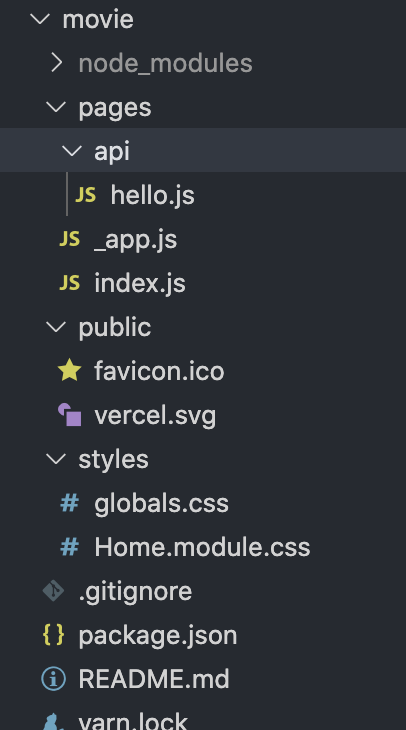
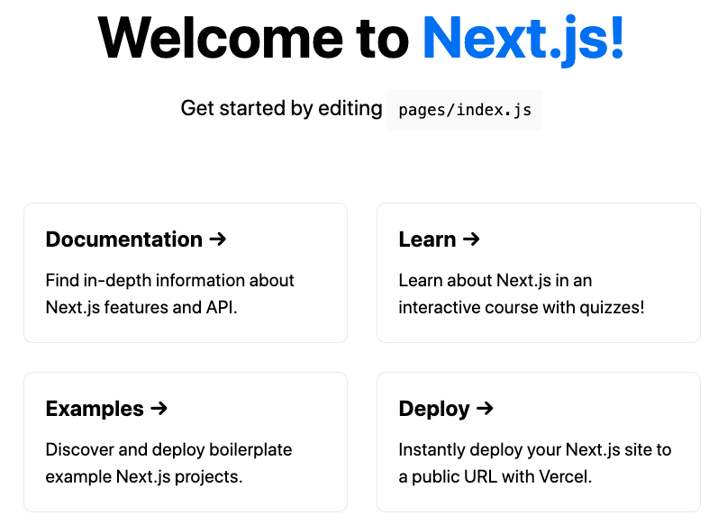

### Setup

1) From target project folder, run either:

    ~~~ bash
    yarn create next-app movie
    ~~~

    or

    ~~~ bash
    npx create-next-app
    ~~~

   - the following file setup will be  created

        

2) Launch the default  `Next.js` app using  either:
   
   ~~~ bash
   npm run dev
   ~~~

    or 

    ~~~ bash
    yarn dev
    ~~~

    - the default app will launch in `localhost:3000`

        

3) Styling in `Next.js` can be applied in a variety of ways:
   - Global stylesheets (require importing the CSS file from within `pages/_app.js`)
   - Importing styles from `node_modules`
   - CSS modules
   - `styled jsx`
