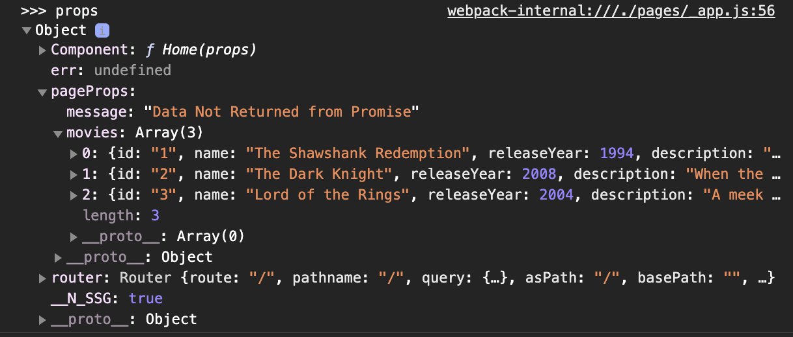

### Setup

1) From target project folder, run either:

    ~~~ bash
    yarn create next-app movie
    ~~~

    or

    ~~~ bash
    npx create-next-app
    ~~~

   - the following file setup will be  created

        

2) Launch the default  `Next.js` app using  either:
   
   ~~~ bash
   npm run dev
   ~~~

    or 

    ~~~ bash
    yarn dev
    ~~~

    - the default app will launch in `localhost:3000`

        

3) Styling in `Next.js` can be applied in a variety of ways:
   - Global stylesheets (require importing the CSS file from within `pages/_app.js`)
   - Importing styles from `node_modules`
   - CSS modules
   - `styled jsx`

4) Pages created in the `pages` folder can be accessed as a route (e.g. /pages/about)

5) After creating -apps.js, Functional Components as well as props called in from `getStaticProps` can be inserted

   - the pageProps obj passed in :
   

   ~~~ js
   class MovieApp extends App {

      render() {

         console.log(">>> props", this.props)

         // Component holds page delivered in route
         const {Component, pageProps} = this.props;
         
         return (
            

               <Head>
                  <title>Home</title>
                  <link rel="stylesheet" href="https://stackpath.bootstrapcdn.com/bootstrap/4.3.1/css/bootstrap.min.css" integrity="sha384-ggOyR0iXCbMQv3Xipma34MD+dH/1fQ784/j6cY/iJTQUOhcWr7x9JvoRxT2MZw1T" crossorigin="anonymous" />
                  
                  
                  
                  </Head>

                  <Navbar />
               

                  <Component {...pageProps}/>
               
	
               
               <Footer />
               {/* example of using styled-jsx */}        
                   
            
            

         )
      }

   }
   ~~~

6) `Next.js` supports `dynamic routing`. This is allows a single file that can be used to render multiple movie detail pages based on the `id` of the movie using square brackets (e.g.  [id].js ).   